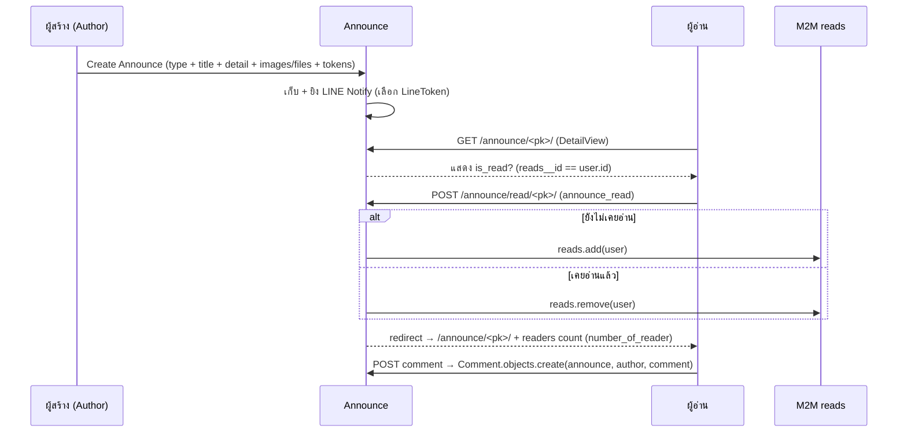
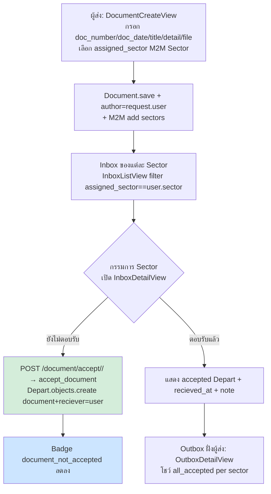
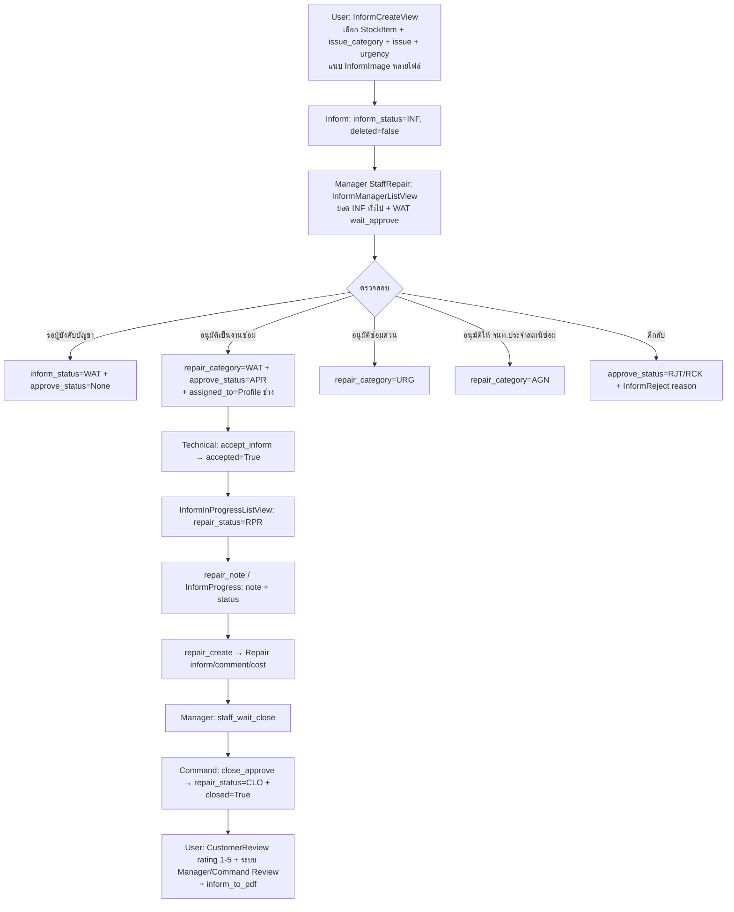
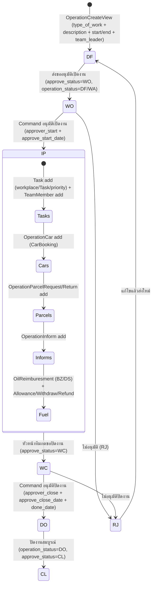
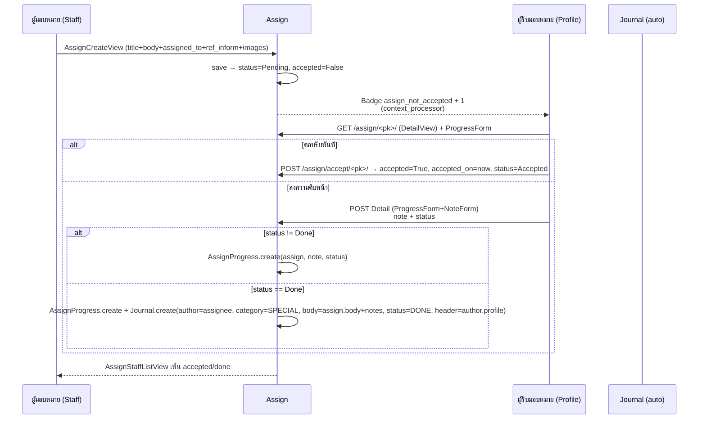

# PRD — TCC WebApp (ระบบบริหารงานภายใน ทค.)

> **Version:** 1.0 · **Date:** 2026-08-24 · **Author:** Lin (หลิน) — Product Owner · **Status:** Draft / Single Source of Truth ก่อน Refactor  
> **Repo:** `/home/lu5her/01-Projects/tcc_webApp` · **Branch:** `docs/prd-tcc-webapp` · **Stack:** Django 4.2 (EOL Apr 2026) · Python 3.13 venv · SQLite  
> **ผู้มอบหมาย:** Aiy (อัย) — Strategic Orchestrator (Fast-track) · **ผู้รับรอง:** Louis

---

## สารบัญ

1. [Product Overview & Goals](#1-product-overview--goals)
2. [System Map — 9 ระบบหลัก](#2-system-map--9-ระบบหลัก)
3. [Roles & Permission Matrix](#3-roles--permission-matrix)
4. [Workflow Diagrams (Mermaid)](#4-workflow-diagrams-mermaid)
5. [Integrations](#5-integrations)
6. [Non-Functional Requirements](#6-non-functional-requirements)
7. [Target State — Refactor Roadmap](#7-target-state--refactor-roadmap)
8. [Open Questions for Louis](#8-open-questions-for-louis)
9. [Appendix — Audit Facts & Tech Inventory](#9-appendix--audit-facts--tech-inventory)

---

## 1. Product Overview & Goals

### 1.1 ภาพรวมผลิตภัณฑ์

**TCC WebApp** คือระบบ Intranet แบบ Monolith สำหรับบริหารงานภายในหน่วยงานทหาร/ราชการ (บริบทจากชื่อ Sector/Department, ยศ Rank, ตำแหน่ง Position, คำว่า “ทภ.2”, “มทบ.29”) ครอบคลุมงานสารบรรณ งานข่าวประชาสัมพันธ์ งานซ่อม/แจ้งซ่อม งานเบิก–จ่ายพัสดุ งานยานพาหนะ งานมอบหมาย และงานขออนุมัติออกปฏิบัติงาน ใช้งานจริงบน Production แล้ว (SQLite, `DEBUG=True` ใน settings ปัจจุบัน)

**ผู้ใช้หลัก:** กำลังพลภายในหน่วย แยกตาม `Sector` (เช่น ปก.ทภ.2) → `Department` (เช่น กอง/ฝ่าย/แผนก) → `Rank` → `Position` → `User/Profile`

**ภาษา UI:** ไทยเกือบทั้งหมด (เมนู ฟอร์ม สถานะ) ผสม technical terms ภาษาอังกฤษในโค้ด

### 1.2 เป้าหมายของ PRD ฉบับนี้

PRD ฉบับนี้ทำหน้าที่ **“Single Source of Truth”** ที่ถอดความรู้ซึ่งปัจจุบันฝังอยู่ในโค้ด Production ออกมาเป็นเอกสารมาตรฐาน เพื่อให้ทีม (An → Mint → Pao → Fah → Cloud) สามารถทำงานต่อบน Refactor Roadmap ได้โดยไม่ต้อง reverse-engineer โค้ดเก่า

| Phase | งาน | เจ้าของ |
|---|---|---|
| Phase 0 | Cleanup — ลบ dead code, จัดระเบียบโค้ด, ตั้งกติกา | Lin + An |
| Phase 1 | Django 4.2 → **5.2 LTS** upgrade (EOL Apr 2026) | An + Cloud |
| Phase 2 | **HTMX migration** — เปลี่ยน full-page redirect → partial template | Pao + Mint |
| Phase 3 | DRF API เฉพาะจุดที่มี consumer จริง (e.g. LINE bot) | An + Pao |

### 1.3 Pain Points ปัจจุบัน (จาก Audit — ห้ามแก้ใน PRD, บันทึกไว้เพื่อแก้ใน Roadmap)

| # | ประเด็น | ความรุนแรง | หมายเหตุ |
|---|---|---|---|
| P1 | **Django 4.2 EOL Apr 2026** — ต้อง upgrade เป็น 5.2 LTS ก่อนสิ้นอายุ | 🔴 Critical | `USE_L10N` ถูกลบใน Django 5.0+, `jazzmin`/`ckeditor` ต้องเช็ค compat |
| P2 | **Dead code:** `announce/serializers.py` import `rest_framework` แต่ `requirements.txt` ไม่มี DRF | 🟡 Medium | มี `connect_api.js` (Google Apps Script LINE bot) เรียก `GET /api/announce` ที่ไม่มีอยู่จริง |
| P3 | **Suspect logic:** `document_not_accepted` context processor ใช้ `abs(len(all_inbox) - len(all_department))` — คิด “ค้างรับ” แบบผลต่างจำนวน ไม่ใช่ diff ของ PK set → คลาดเคลื่อนเมื่อมีการรับซ้ำ/ลบ | 🟡 Medium | ดู §8 Q1 — ห้าม fix ใน PRD, ตั้งคำถามก่อน |
| P4 | **Monolith หนัก** — ~13 apps, ~6,120 บรรทัด `views.py` รวม, ~726 templates, CBV ผสม FBV, มี `bill.bk` (backup) ค้างใน repo | 🟡 Medium | ต้องแยก concern, ตั้ง naming convention |
| P5 | **SQLite + DEBUG=True บน Production** + `ALLOWED_HOSTS=["*"]` + `SECRET_KEY` hard-code | 🔴 Critical | ต้องย้ายไป Postgres + env-based config ใน Target State |
| P6 | **No API layer** แต่มี consumer อยากเรียก (LINE bot) | 🟠 High | วางแผน DRF เฉพาะ `/api/announce` ก่อน |
| P7 | **Template ทับซ้อน** — `account/context_processors` ฉีด counts ทุกหน้า แต่ก็มี logic ซ้ำใน `HomeView`/`helpers.py` | 🟢 Low | HTMX จะช่วยลด full-page reload แล้วค่อยรวม logic |

### 1.4 Audit Facts ยืนยันแล้ว (สรุป — ใช้แทนการ re-discover)

- **Stack:** Django 4.2, Python 3.13 venv, CBV (`ListView`/`DetailView`/`CreateView`/`UpdateView`/`DeleteView`/`TemplateView`) ทุกแอป, `LoginRequiredMixin` ครอบทุก view หลัก
- **Frontend:** Bootstrap 5 + jQuery + `axios` + DataTables + Select2 + Flatpickr (อยู่ `static/`)
- **PDF/Print:** `xhtml2pdf` + `reportlab` + `qrcode` + `arabic-reshaper`/`python-bidi` สำหรับฟอร์มราชการพิมพ์ได้ (`bill_to_pdf`, `return_pdf`, `inform_to_pdf`, `operation` PDFs)
- **Admin:** `django-jazzmin` (config ใน `config/settings.py` JAZZMIN_SETTINGS)
- **Forms:** `crispy-forms` (bootstrap4) + `CKEditor` (RichTextField) ใช้ใน announce/assign/inform/operation
- **Apps ↔ Business Systems:** ดู §2
- **Cross-module links:** `assign.ref_inform → inform`, `repair.inform → inform`, `operation.parcel_requests / parcel_returns / cars / informs`, `parcel.RequestItem → asset.StockItem` (via `Category`)
- **Global counts:** context processors ใน `account/context_processors.py` + `parcel/context_processors.py` ฉีด `assign_not_accepted`, `announce_not_read`, `document_not_accepted`, `new_inform`, `car_booking`, `items_on_hand`, `count_total` ทุก template
- **Known dead code:** ดู P2  — รายละเอียด §8 และ §5

---

## 2. System Map — 9 ระบบหลัก

> แต่ละระบบระบุ: **Purpose · Core Entities (จาก `models.py` จริง) · User-facing Features (จาก `views.py`/`urls.py`/templates จริง) · Status**

### 2.1 ระบบที่ 1 — `account` — บัญชีผู้ใช้ & โครงสร้างองค์กร

**Purpose:** จัดการตัวตนผู้ใช้และความสัมพันธ์เชิงองค์กร (Sector/Department/Rank/Position) เป็นรากฐานให้ทุกระบบอ้างอิง

**Core Entities** (`account/models.py`):

| Entity | Fields สำคัญ | Relation |
|---|---|---|
| `User` (django.contrib.auth) | username, email, groups, is_superuser | 1–1 → Profile (signal auto-create) |
| `Profile` | rank, position, sector, department, phone, image, about, line_id, line_token, socials | OneToOne User; FK → Rank/Position/Sector/Department |
| `Sector` | name | 1–N → Department |
| `Department` | name, sector | FK Sector |
| `Rank` | name (ยศ) | |
| `Position` | name (ตำแหน่ง) | |
| `LineToken` | name, token, note | ใช้ยิง LINE Notify แยกต่อกลุ่ม |

*Signals:* `post_save` User → `Profile.objects.create` + `instance.profile.save()` → ทุก User มี Profile เสมอ แต่ `__str__` มี branch `if self.rank` กัน null

**User-facing Features** (`account/views.py`, `account/urls.py`, `account/context_processors.py`):

- `HomeView` (Dashboard `/`) — รวม counts: inbox/assign/not_read/journal/bills/car_booking, ใช้ `helpers.py` (`get_inbox_counts`, `get_journals`, `get_not_read_announces`)
- Register / Login / Logout / ChangePassword (`django.contrib.auth.urls` + `RegisterView`)
- Members / Profile / Contact — `MembersListView`, `ProfileView` (UserForm + ProfileForm)
- Global context processors ฉีด badge counts ทั้งไซต์: `assign_not_accepted`, `announce_not_read`, `document_not_accepted`, `new_inform`, `car_booking`, `count_total` (+ `parcel.items_on_hand`)
- Components: `header`, `sidebar`, `notification_list`, `profile_dropdown`, `cart_dropdown`, `photoswipe`

**Status:** ✅ **Working** — เป็นศูนย์กลาง auth/org, ทุก app อ้าง `request.user.profile` / `sector` / `department`; แต่ counts logic มี duplication และ suspect formula (ดู §8)

---

### 2.2 ระบบที่ 2 — `announce` — ข่าวประชาสัมพันธ์/สั่งการ + Read Receipts

**Purpose:** เผยแพร่ข่าวสารภายใน 3 ประเภท (ประชาสัมพันธ์/สั่งการ/ประสานงาน) พร้อมติดตามว่าใครอ่านแล้ว/ยังไม่อ่าน และคอมเมนต์

**Core Entities** (`announce/models.py`):

| Entity | Fields สำคัญ | Relation |
|---|---|---|
| `Announce` | is_type (INFORM/ORDER/COORDINATE), status (PUBLISH/DONE), author FK User, title, detail (TextField/เคยเป็น RichTextField), reads M2M User, created_at, is_delete | M2M reads → User (read receipt) |
| `AnnounceImage` | announce FK, images ImageField (`Announce/Images/{title}/{file}`) | |
| `AnnounceFile` | announce FK, files FileField (`Announce/Files/...`) | |
| `Comment` | announce FK, author FK User, comment TextField, created_at (ordering -created_at) | |

**User-facing Features** (`announce/views.py`, `urls.py`: `''`, `'<pk>/'`, `'create/'`, `'update/<pk>/'`, `'delete/<pk>/'`, `'read/<pk>/'`, `'not-read/'`):

- List / Detail / Create / Update / Delete (CBV, `LoginRequiredMixin`)
- **Read receipt toggle:** `announce_read(request, pk)` → `if user in reads → remove else add` → redirect detail
- Comment threads ใน `AnnounceDetailView.post()` — สร้าง Comment แล้ว redirect กลับ
- LINE Notify เมื่อสร้าง announce ใหม่: อ่าน `tokens` จาก POST, `LineNotify(token).send_message(head+body+url)` + `send_image` loop (โหลด `LineToken` จาก DB)
- Templates: `announce/announce.html`, `detail.html` (+ components `readers`, `comments`, `files_tab`, `images_tab`)

**Status:** ✅ **Working** (core) / ⚠️ **Partial/Dead:** `announce/serializers.py` (AnnounceSerializer, AnnounceImage/File/CommentSerializer) import DRF แต่ DRF ไม่ถูกติดตั้ง → import จะล้มถ้ามีคนเรียก; `connect_api.js` เรียก `/api/announce?userId=` ที่ไม่มี route → dead integration

---

### 2.3 ระบบที่ 3 — `document` — งานสารบรรณ (ส่ง–ตอบรับหนังสือ)

**Purpose:** รับ–ส่งหนังสือราชการระหว่าง Sector/Department แบบกระจาย (M2M assigned_sector) แล้วให้แต่ละ Sector “ตอบรับ” หนังสือผ่าน `Depart`

**Core Entities** (`document/models.py`):

| Entity | Fields | Relation |
|---|---|---|
| `Category` | name | (เคยใช้แยกประเภทหนังสือ) |
| `Document` | recieve_number, doc_sector, doc_number, doc_date, category FK, urgency (ปกติ/ด่วน/ด่วนมาก/ด่วนที่สุด), title/detail (Text), report_to, operation (ปฏิบัติ/เพื่อทราบ), file, author FK User, assigned_sector M2M Sector, is_deleted, created_at | M2M Sector |
| `Depart` | document FK, reciever FK User, recieved_at, note | 1 ใบรับ = 1 Sector-Receiver (ตาม code: filter `reciever__profile__sector`) |
| `Operator` | document FK, reciever FK Profile, note | (model มีแต่ไม่เห็นใช้ใน views ปัจจุบัน — suspect dead) |

**User-facing Features** (`document/views.py`, `urls.py`: `''`, `'create/'`, `'inbox/'`, `'inbox/<pk>/'`, `'outbox/'`, `'outbox/<pk>/'`, `'accept/<pk>/'`):

- Home — แสดง inbox/outbox/today counts (`abs(all_inbox - all_department)`)
- `DocumentCreateView` — ฟอร์ม `DocumentForm` (SelectMultiple `assigned_sector` via Select2 class `select`) + `author = request.user`, add M2M loop
- `InboxListView` — `Document.objects.filter(assigned_sector=user.sector, is_deleted=False)` + `pk_list = Depart...values_list(document__pk)`
- `InboxDetailView` — หา `Depart` ของ sector ปัจจุบัน → `accepted` context
- `OutboxListView/DetailView` — filter `author__profile__sector`
- `accept_document(request, pk)` — สร้าง `Depart(document, reciever=request.user)` (= ตอบรับ)
- Soft-delete `is_deleted` / `is_delete` (มี 2 ชื่อใน model ต่างกัน! — `Document.is_deleted` vs `Announce.is_delete` — ต้อง normalize ตอน refactor)

**Status:** ✅ **Working** (inbox/outbox/accept flow ใช้จริง) / ⚠️ **Partial:** `Operator` model ไม่ได้ใชงาน, `abs(len - len)` เป็น suspect logic, `DocumentUpdate/Delete` views มีบัค typo (`requst.POST`, `self.template` vs `template_name`) — ไม่พังเพราะไม่ค่อยได้เรียก แต่ต้องแก้

---

### 2.4 ระบบที่ 4 — `asset` + `parcel` + `cart` — บริหารพัสดุ/ครุภัณฑ์ & เบิก–จ่าย–คืน

> นับเป็น **1 ระบบ** (พัสดุ) แยก 3 apps ทางเทคนิค: `asset` = คลัง/ทะเบียน, `cart` = ตะกร้า session, `parcel` = ใบเบิก/ใบส่งคืน + approval chain + PDF

#### 2.4.1 `asset` — ทะเบียนพัสดุ

**Core Entities** (`asset/models.py`):

| Entity | Fields สำคัญ |
|---|---|
| `Category` | name, description, image |
| `Supplier` | name, address, contact_no |
| `Network` | name, ip_addr, description |
| `Manufacturer` | name, description |
| `StockItem` | item_name, serial (unique), description, quantity, price, stock_control (RELAY/SATT/FO/DATA/AIR), location_install FK Department, location_item FK Department, category FK, supplier FK, manufacturer FK, network FK, status (AVAILABLE/IN_USE/UNDER_MAINTENANCE/DISPOSED/CHECK/HOLD/ON_HAND), count_text, `available` manager (filter AVAILABLE) |
| `StockItemImage` | stock_item FK, images |
| `ItemLocation` | item FK, location FK Department |
| `ItemOnHand` | item FK, user FK, is_done |
| `ItemHistory` | item FK, user FK, description |

**Features** (`asset/views.py`, `urls.py`): Home/Category/StockList/Detail/Create/Update/Delete, `StockDepartmentListView` (filter `location_install == user.department`), Manage views

**Status:** ✅ **Working** — เป็น master data ให้ parcel

#### 2.4.2 `cart` — ตะกร้าเบิก (Session-based)

**Core:** `cart/cart.py` — `Cart(request)` เก็บ `request.session[CART_SESSION_ID] = {category_id: {quantity}}`, methods `add/update/remove/clear/__iter__/__len__`, `__iter__` yield `category` + `available_quantity` (sum AVAILABLE stockitems)

**Features** (`cart/views.py`): `cart_add`, `update_cart`, `cart_remove`, `cart_detail` (POST-only)

**Status:** ✅ **Working** — ไม่มี model DB, อาศัย session

#### 2.4.3 `parcel` — ใบเบิก & ใบส่งคืน + สายอนุมัติ + พิมพ์ฟอร์ม

**Core Entities** (`parcel/models.py`):

| Entity | Fields สำคัญ | Relation |
|---|---|---|
| `ParcelRequest` | user FK, stock FK Department (คลังที่เบิก), status (DRAFT/REQUEST/IN_PROGRESS/DONE), is_done, date_done | 1–1 → RequestBillDetail |
| `RequestItem` | bill FK ParcelRequest, category FK, item FK StockItem (nullable — ตอนแรกเบิกตาม category แล้วค่อย assign serial), quantity, quantity_approve, paid, recieved + dates | |
| `RequestBillDetail` | bill OneToOne ParcelRequest, approve_status (WAIT/APPROVED/UNAPPROVED), approve_date, approver FK, receiver FK Profile, paid_status (PAID/RECEIVED), paider FK, request_case (BASIC/REPLACE/BORROW), item_type/item_control/money_type/job_no, agent FK | |
| `ParcelRequestNote` / `RejectBillNote` | bill OneToOne, note, user FK | |
| `ParcelReturn` | user FK, stock FK, department_return FK, status (DRAFT/REQUEST/WAIT/DONE), is_done, deleted | |
| `ParcelReturnDetail` | bill OneToOne, approve_status, return_case (UWT/UAI/UCD/S/E/L), return_status (WAIT/RETURNED), approver/receiver/controler FKs, return_no | |
| `ParcelReturnItem` | bill FK ParcelReturn, item FK StockItem, quantity | |
| `RejectReturnBillNote` / `ParcelReturnBillNote` | | |

**Features** (`parcel/views.py` ~1,200 บรรทัด, `parcel/urls.py` มาก):

- User flow: `SelectStockView` → `SelecItemView/<pk>` (เลือกคลัง → โชว์ Category+StockItem ที่ AVAILABLE) → `Cart` → `BillCreateView` (POST `stock` → สร้าง `ParcelRequest` + `RequestItem`s per cart + `RequestBillDetail` + `cart.clear()` → redirect `bill_detail`)
- `BillDetailView` — จัดการ `RequestBillDetailForm`, `set_serial_item`, `paid_item`, `replace_item`
- `ParcelListView` (พัสดุที่รับแล้ว), `ItemOnHandListView`, `RecieveItemsView`, `SetItemLocation`, `ReplaceItemLocation`, `RemoveItem`, `LocationList`, `item_on_location`
- Return flow: `ReturnParcelCreateView` → `ReturnParcelDetailView` → `save_return_draft` / `return_item`
- Manager flow (filter `stock == user.department`): `BillManagerListView`, `BillWaitApproveListView` (WAIT), `BillWaitPaidListView` (APPROVED & not done), `ManagerAllBillListView`, `request_approve`, `set_serial_item`, `PaidItemView`, `ReturnManagerListView`, `checker_confirm_return`
- Command flow: `approve_bill`, `reject_bill`, `bill_to_pdf`, `return_pdf`, `return_approve`, `return_controler`, `return_done`, `CommandWaitApproveListView`, `ReturnCommandListView`
- PDF: `bill_to_pdf` / `return_pdf` → `generate_pdf(data, "parcel/bill_pdf.html")` via `xhtml2pdf` + `reportlab` + `qrcode`

**Status:** ✅ **Working** (ใบเบิก/ใบคืน/สายอนุมัติ/พิมพ์ฟอร์ม ใช้จริง) / ⚠️ ระวัง `RequestItem.item` nullable → ต้องมี step “จับคู่ serial” ก่อนจ่าย; `count_text` / `ItemLocation` ค้างจากการ migrate หลายรอบ

---

### 2.5 ระบบที่ 5 — `inform` + `repair` — แจ้งซ่อม

**Purpose:** ผู้ใช้แจ้งซ่อมพัสดุ/อุปกรณ์ (`StockItem`) → ฝ่ายซ่อมตรวจสอบ → ผู้บังคับบัญชาอนุมัติ → มอบหมายช่าง → ซ่อม → Review/Close

**Core Entities**:

`inform/models.py`:

| Entity | Fields สำคัญ |
|---|---|
| `Inform` | customer FK User, stockitem FK StockItem, issue_category (HW/SW/RP/OT), issue Text, urgency (HIG/MED/LOW), inform_status (INF/WAT/REJ), approve_status (APR/RJT/RCK), repair_category (WAT/URG/AGN), assigned_to FK Profile, accepted Bool, repair_status (ACC/RPR/CMP/REJ/CLO), created_at, deleted, closed |
| `InformImage` | inform FK, images (`Inform/{pk}/...`) |
| `InformProgress` | inform FK, note, status (RepairStatus) |
| `InformReject` | inform FK, reason |
| `CustomerReview` / `ManagerReview` / `CommandReview` | date_created, rating 1–5, description, reviewer FK User, inform FK |
| `InformOption` | inform FK, car FK CarBooking (nullable) — ลิงก์ไปยานพาหนะ |

`repair/models.py`:

| Entity | Fields |
|---|---|
| `Repair` | inform OneTo? FK Inform (`inform_repair`), comment RichTextField, cost Integer, created_at |

**Features** (`inform/views.py` ~1,092 บรรทัด, `repair/views.py` 15 บรรทัด, `inform/urls.py`):

- `InformHomeView` — เลือก template ตาม Group: `StaffRepair→manager.html`, `Technical→technical.html`, `Command→command.html`, else `user_inform.html`
- User: `InformCreate/Update`, `InformUserListView`, `InformDepartmentListView`, `InformAgentListView`, `InformWaitListView`, `InformDetailView`, `customer_wait_to_review`, `review_save`, `inform_to_pdf`
- Manager: `InformManagerListView`, `InformWaitApproveListView`, `staff_wait_close`, counts: `inform_status=INF` (ใหม่), `WAT & approve_status=None` (รอ Approve), `repair_category=URG/AGN` etc.
- Technical: `accept_inform`, `InformTechnicalListView`, `InformInProgressListView`, `repair_note`, `all_assigned`
- Command: `inform_approve`/`inform_reject`, `wait_close_approve`, `command_wait_approve`, `all_progress`, `all_recheck`, `close_approve`
- `repair_create(request, inform_pk)` — สร้าง `Repair(inform, comment, cost)` แล้ว redirect

**Status:** ✅ **Working** (โฟลว์แจ้งซ่อมแบบมีสายอนุมัติ+มอบหมายใช้จริง) / ⚠️ `InformOption` ดูเหมือนกึ่ง dead (มีแค่ car link), `Repair` 1-1 ไม่ชัด (FK ไม่ unique), duplicate templates ต่อ role เยอะ

---

### 2.6 ระบบที่ 6 — `operation` — ขออนุมัติออกปฏิบัติงาน (ใบงาน)

**Purpose:** ใบงานรวมศูนย์ — ผูก `Inform` (ใบแจ้งซ่อม) + `ParcelRequest/Return` (เบิก/คืนพัสดุ) + `CarBooking` (ยานพาหนะ) + `Task/Team/Allowance` เข้าด้วยกัน แล้วเดินสายอนุมัติ เปิดงาน → ปิดงาน

**Core Entities** (`operation/models.py`):

| Entity | Fields สำคัญ |
|---|---|
| `Operation` | type_of_work (BR/SAT/FO/DC/AC/OT), other_type, description, start/end_date, approve_status (AP/WO/WC/CL/RJ), operation_status (WA/IP/DO/DF), created_by FK User, done_date, approver_start/close FKs, own_car Bool, is_deleted |
| `Task` | operation FK, workplace FK Department, task Text, priority (CR/UR/NR/OT), status (PD/CL), is_done, note, done_date |
| `Team` | operation OneToOne, team_leader FK User, accepted Bool/date |
| `TeamMember` | team FK, member FK User |
| `OilReimburesment` | operaion FK (typo ใน field name!), oil_type (BZ/DS), liter_request |
| `Allowance` | user FK, operation OneToOne, total_withdraw, number_of_withdraw |
| `AllowanceWithdraw` | allowance FK, amount, note |
| `AllowanceRefund` | allowance OneToOne, refund_amount |
| `OperationCar` | operation FK, car_booking FK CarBooking |
| `OperationParcelRequest` | operation FK, parcel_request FK |
| `OperationParcelReturn` | operation FK, parcel_return FK |
| `OperationDocument` | operation FK, file (`operation/{pk}/...`) |
| `OperationInform` | operation FK, inform FK |

**Features** (`operation/views.py` ~935 บรรทัด, `operation/urls.py`):

- `OperationHome` — แยกสถิติ per user (`team__members__member=user`) vs command overview (`approve_status WO/WC`)
- `OperationCreateView` (GET/POST) — สร้าง `Operation` + `Team` (auto `accept()` ถ้า `created_by == team_leader`)
- `OperationDetailView` — ดึง `Team`, `Task`s, `TeamMember` formset, `OperationCar`, `OilReimburesment` (annotate Sum), `AllowanceWithdraw`, `parcel_requests/returns`, `OperationInform`, forms: `CarAddForm`, `TaskForm`, `AddFuelForm` etc.
- Sub-routes: `team/member/create/delete`, `car/add/change/delete`, `task/add/delete/add_note`, `fuel/add/update/delete`, `allowance/add/delete/refund`, `parcel/request+return add/delete`, `inform/add`, `document/add`, `approve_start/close` (accept_leader, etc.)
- PDFs: `operation` ใช้ `generate_pdf` ทำฟอร์มใบเบิกน้ำมัน/ใบงาน

**Status:** ✅ **Working** (หัวใจ cross-module) / ⚠️ `OilReimburesment.operaion` typo, `Allowance` OneToOne ทำให้ 1 operation มี ได้คนเดียว — ถ้าต้องเบิกหลายคนต้องปรับ

---

### 2.7 ระบบที่ 7 — `car` — ยานพาหนะ (จอง/เติมน้ำมัน/ซ่อม)

**Purpose:** ทะเบียนรถ + ใบขอใช้รถ (จอง/อนุมัติ/คืน/ใช้งาน) + ใบแจ้งซ่อมรถ + เติมน้ำมัน — Multiple image upload ผ่าน through-models แยกประเภท

**Core Entities** (`car/models.py`):

| Entity | Fields สำคัญ |
|---|---|
| `Car` | car_type (van/truck/bus/wagon/other), number, manufacturer, color, capacity, fuel_max/fuel_rate/fuel_now, status (ready/pending/wait/inuse/fix/not_ready), responsible_man FK Profile, mile_now, car_avatar |
| `CarBooking` | car FK, requester FK User, mission Text, driver FK Profile, passenger, controler/approver FK Profile, requested_at, mile_in/out, distance, return_at, fuel_use, status (pending/approve/reject/cancel/done) |
| `CarFix` | car FK, issue Text, fix_requester FK User, approver FK Profile, cost_use, approve_status (pending/approve/reject/cancel/done), fix_status (pending/in_maintenance/finished), note, responsible_man FK Profile |
| `Refuel` | car FK, refuel Float, mile_refuel, refueler FK User, note RichTextField |
| `CarImage` | car FK, images (`Car/{number}/{file}`) |
| `CarFixImage` | fix FK, images (`Car/Fix/{number}/{file}`) |
| `CarAfterFixImage` | fix FK, images (after-fix) |

**Features** (`car/views.py` ~708 บรรทัด, `car/urls.py`):

- `CarList/Create/Update/Detail` — `CarImage` multiple upload (`request.FILES.getlist("images")`)
- Booking: `CarBookingListView` (filter: ถ้า `Car` group หรือ Staff → all, else `Q(requester=user)|Q(driver=user.profile)|Q(approver=user.profile)`), `CarBookingCreateView/<pk>` (set `car.status=PENDING`), `CarBookingDetail/Update`, `WaitApproveListView`, `car_booking_approve/reject`, `UseCar`, `ReturnCar`
- Fix: `CarRequestFixListView`, `CarFixCreateView/<pk>`, `CarRequestFixDetailView`, `CarFixUpdateView`, `CarAfterFixView`, `ResponsibleListView`, `RefuelCar`
- Multiple image models: `CarImage` / `CarFixImage` / `CarAfterFixImage` แยกหมวดชัดเจน

**Status:** ✅ **Working** — ครบทั้ง จอง/อนุมัติ/ซ่อม/เติมน้ำมัน + รูปหลายหมวด

---

### 2.8 ระบบที่ 8 — `assign` — มอบหมายงาน + ติดตามความคืบหน้า

**Purpose:** มอบหมายงานระหว่างบุคคล (cross-Sector) มี accept flag + progress log + เชื่อมใบแจ้งซ่อมผ่าน `ref_inform` → เมื่อ Done จะ auto สร้าง `Journal`

**Core Entities** (`assign/models.py`):

| Entity | Fields สำคัญ |
|---|---|
| `Assign` | title, body Text, author FK User, assigned_to FK Profile, accepted Bool, accepted_on DateTime, status (Pending/Accepted/Rejected/Done), note Text, ref_inform FK Inform (nullable) |
| `AssignImage` | assign FK, images (`Assign/{title}/{file}`) |
| `AssignProgress` | assign FK, note, status (Assign.Status), created_at |

*Logic:* `save()` — ถ้า `accepted=True` & `accepted_on is None` → set `accepted_on=now()` + `status=Accepted`; ถ้า `accepted=False` & `accepted_on not None` → clear date

**Features** (`assign/views.py` ~365 บรรทัด, `assign/urls.py`: `''`, `'user/'`, `'staff/'`, `'<pk>/'`, `'create/'`, `'<pk>/update/'`, `'delete/<pk>'`, `'not-accepted/'`, `'accept/<pk>/'`):

- `AssignHomeView` — แยก `assign_to_user` / `assign_by_user` + `not_accepted` counts
- `AssignListView` (to me: `assigned_to=user.profile`), `AssignStaffListView` (by me: `author=user`), `AssignDetailView` (+ `ProgressForm`, `NoteForm`, `AssignProgress` list)
- `AssignDetailView.post()` — บันทึก `ProgressForm` + `NoteForm` → ถ้า `status != "Done"` สร้าง `AssignProgress`; ถ้า `Done` → สร้าง `Journal(author=user, category=SPECIAL, title/body=assign, status=DONE)`
- `AssignCreateView` — ฟอร์ม `AssignForm(current_user=profile.pk)` + multiple image upload
- `AssignNotAcceptedView`, `accepted(request, pk)` — toggle `accepted/status`

**Status:** ✅ **Working** — cross-module via `ref_inform`, auto-journal เมื่อ Done

---

### 2.9 ระบบที่ 9 — `journal` — บันทึกการปฏิบัติงาน

**Purpose:** บันทึกประจำวัน/บันทึกพิเศษ/อื่นๆ ผู้ใช้บันทึกงานของตนเอง มีรูปประกอบ คล้าย daily log ที่ใช้ปิดงานจาก `assign`

**Core Entities** (`journal/models.py`):

| Entity | Fields |
|---|---|
| `Journal` | author FK User, category (Routine/Special/Other), title, body Text, status (In Progress/Done/Cancelled), header FK Profile (หัวหน้ารับรอง), created_at, updated_at |
| `JournalImage` | journal FK, images (`JournalImages/%Y/%B/{title}/{file}`) |

**Features** (`journal/views.py`: `JournalListView` (filter `author=user`), `JournalDetailView` (+ images), `JournalCreateView` (multiple images), `JournalUpdateView`):

- Create/List/Detail/Update ทั้งหมด `LoginRequiredMixin`
- ถูกสร้างอัตโนมัติจาก `AssignDetailView` เมื่อมอบหมายงานเสร็จ (category=SPECIAL)

**Status:** ✅ **Working** — เรียบง่าย แต่ได้ใช้จริงเป็น audit trail ปิดงาน

---

## 3. Roles & Permission Matrix

### 3.1 Organization Model (จาก `account/models.py` จริง)

```
Sector (หน่วยใหญ่, e.g. ปก.ทภ.2)
  └── Department (กอง/ฝ่าย/แผนก, e.g. ธ.ก., ฝก.บ.)
        └── User → Profile (OneToOne)
              ├── Rank (ยศ)
              ├── Position (ตำแหน่ง)
              ├── place / phone / image / about / address
              └── socials (twitter/facebook/instagram/line_id/line_token)
```

- **Profile auto-create:** `post_save` User → สร้าง Profile ทุกครั้ง
- **LineToken (แยก):** `LineToken(name, token)` สำหรับยิง LINE Notify เป็นกลุ่ม (ไม่ผูกกับ Profile โดยตรง แต่เลือก `tokens` ตอนสร้าง Announce)

### 3.2 Groups (django.contrib.auth.models.Group — string-based)

> ไม่ได้มี Group model custom — ใช้ `user.groups.filter(name="...").exists()` กระจายใน views/context_processors

| Group name | พบในไฟล์ | ความหมาย / ใช้ที่ไหน |
|---|---|---|
| `Staff` | `account.HomeView`, `car.CarBookingListView` | จนท.บริหาร — เห็น Assign ที่ตนเองสั่ง, เห็น CarBooking ทั้งหมด |
| `StaffRepair` | `account.HomeView` (exclude), `inform` (TEMPLATE_NAMES) | จนท.ฝ่ายซ่อม (admin ของ inform) — เห็น dashboard manager |
| `Technical` | `account.context_processors.new_inform`, `inform.TEMPLATE_NAMES` | ช่างเทคนิค — เห็น `new_inform`, รับงานซ่อม (`Inform.assigned_to`) |
| `Manager` | `account.context_processors.new_inform` | หัวหน้างาน — เห็น `new_inform`, อนุมัติเบื้องต้น |
| `Command` | `account.context_processors.new_inform`, `inform.TEMPLATE_NAMES`, `car.context_processors` | ผู้บังคับบัญชา — อนุมัติขั้นสุดท้าย (inform/command_approve, parcel/approve_bill, operation/approve) |
| `Car` | `car.CarBookingListView` | จนท.ยานพาหนะ — เห็น CarBooking ทั้งหมด |

*ไม่มี Group `Admin` แยก — ใช้ `is_superuser`/`is_staff` สำหรับ admin site (`jazzmin`)*

### 3.3 Permission Enforcement

| ชั้น | วิธี | ตัวอย่าง |
|---|---|---|
| **Authentication** | `LoginRequiredMixin` ทุก CBV + `LOGIN_URL="login"` | `account`, `announce`, `document`, `asset`, `assign`, `car`, `inform`, `parcel`, `operation`, `journal` |
| **Authorization (object-level)** | Filter by `request.user.profile` / `sector` / `department` ใน `get_queryset()` | `document.InboxListView`: `assigned_sector=user.profile.sector`; `parcel.BillWaitApproveListView`: `stock=user.profile.department` |
| **Authorization (group-based)** | `if user.groups.filter(name=...).exists()` → เลือก template / queryset | `inform.InformHomeView.get_template_names()` → 4 templates ต่อ role |
| **Notification counts** | `context_processors` ฉีด badge + `count_total` (รวมทุก badge) | `account/context_processors.count_total` |

### 3.4 Permission Matrix (ย่อ — ต่อ 9 ระบบ)

| ระบบ | Anonymous | Authenticated (ทั่วไป) | Staff | StaffRepair/Manager | Technical | Command | Car group |
|---|---|---|---|---|---|---|---|
| **account / Dashboard** | → login | ✅ ดู dashboard ของตัวเอง | ✅ + เห็น assign ที่สั่ง | | | | |
| **announce** | → login | ✅ อ่าน/คอมเมนต์/กดรับทราบ | ✅ สร้าง/แก้ไข/ลบ | | | | |
| **document** | → login | ✅ inbox/outbox ตาม Sector, accept ได้ | | | | | |
| **asset (ทะเบียน)** | → login | ✅ ดูรายการ/ดูตาม department | ✅ สร้าง/แก้ไข/ลบ | | | | |
| **parcel (เบิกพัสดุ)** | → login | ✅ สร้างใบเบิก (via cart), ดูของตัวเอง | | ✅ ตรวจสอบ/ตั้ง serial/จ่าย (Manager: `stock==dept`) | | ✅ อนุมัติ/พิมพ์ PDF | |
| **inform/repair** | → login | ✅ แจ้งซ่อม/ดูของแผนกตัวเอง/Review | | ✅ Manager view (รายการทั้งหมด/รอ approve) | ✅ รับงาน/ซ่อม/ลง progress | ✅ อนุมัติ/ตีกลับ/ปิดงาน | |
| **car** | → login | ✅ จองรถ/ดูรายการของตัวเอง | ✅ เห็นทั้งหมด | | | ✅ อนุมัติจอง (approver) | ✅ เห็นทั้งหมด + รับซ่อม |
| **assign** | → login | ✅ รับมอบหมาย/ตอบรับ/ลง progress → auto Journal | ✅ สร้าง/ดูที่สั่ง | | | | |
| **operation** | → login | ✅ สร้างใบงาน/เพิ่ม task/team/parcel/car | | | | ✅ อนุมัติเปิด/ปิดงาน | |
| **journal** | → login | ✅ สร้าง/ดูของตัวเอง | | | | | |

*หมายเหตุ:* ไม่มี `@permission_required` / `UserPassesTestMixin` แยก — ทุกหน้าอาศัย `LoginRequiredMixin` + manual filter → ต้องเสริม permission เชิงนโยบายใน Target State (เช่น `403` ถ้าไม่ใช่เจ้าของ Sector)*

### 3.5 Data Isolation Rule (นโยบายปัจจุบัน — ต้องคงไว้หลัง refactor)

- **Sector isolation:** `document`, `journal`, `inform (department_list)` แยกตาม `user.profile.sector`
- **Department isolation:** `asset (StockDepartmentListView)`, `parcel (stock == department)` แยกตาม `user.profile.department`
- **Profile isolation:** `assign`, `car booking` แยกตาม `assigned_to` / `requester` / `driver` / `approver`

---

## 4. Workflow Diagrams (Mermaid)

### 4.1 Announce — Read Receipt Flow



### 4.2 Document — Send → Accept Flow



> ⚠️ หมายเหตุ logic ปัจจุบัน: badge คิด `abs(len(all_inbox) - len(Depart where reciever.sector==...))` — ดู §8 Q1

### 4.3 Parcel — Requisition → Return Flow (เบิก → จ่าย → รับ → คืน)

```mermaid
flowchart TD
  subgraph Requisition [สายเบิก]
    A1[SelectStockView: เลือก Department คลัง] --> A2[SelecItemView: โชว์ Category/StockItem AVAILABLE]
    A2 --> A3[cart_add: ใส่ Category+quantity ลง Session Cart]
    A3 --> A4[BillCreateView POST stock →<br/>ParcelRequest user/stock +<br/>RequestItem per cart +<br/>RequestBillDetail + cart.clear]
    A4 --> B1[BillDetailView DRAFT<br/>กรอก billdetail: request_case/item_type/money_type/job_no/receiver]
    B1 --> B2[save_draft → status=DRAFT]
    B2 --> B3[request_bill → status=REQUEST/IN_PROGRESS]
    B3 --> C1[Manager: BillWaitApproveListView<br/>request_approve → approve_status=WAIT→APPROVED]
    C1 --> C2[Manager: set_serial_item →<br/>จับคู่ StockItem serial → status HOLD]
    C2 --> C3[Manager: PaidItemView →<br/>paid_status=PAID + paider + paid_at]
    C3 --> D1[User: RecieveItemsView →<br/>paid_status=RECEIVED + ItemOnHand is_done]
    D1 --> D2[ParcelListView: พัสดุที่ถือครอง]
  end

  subgraph Return [สายส่งคืน]
    R1[ReturnParcelCreateView: เลือก ItemOnHand] --> R2[ParcelReturn + ParcelReturnItem[]<br/>+ ParcelReturnDetail status=DRAFT]
    R2 --> R3[save_return_draft → REQUEST/WAIT]
    R3 --> R4[Manager: checker_confirm_return]
    R4 --> R5[Command: return_approve → APPROVED]
    R5 --> R6[Command: return_controler + return_done → DONE/RETURNED]
    R6 --> R7[PDF: return_pdf via xhtml2pdf]
  end

  D2 -.-> R1
  C3 --> P1[bill_to_pdf: xhtml2pdf + qrcode<br/>parcel/bill_pdf.html]
```

### 4.4 Repair Report Flow (Inform → Repair)



### 4.5 Operation — Approval Chain (ขออนุมัติออกปฏิบัติงาน)



### 4.6 Car — Booking / Fuel / Fix

```mermaid
flowchart TD
  subgraph Booking
    B1[CarListView] --> B2[CarBookingCreateView /car/booking/create/<car_pk>/<br/>mission + driver + approver + requested_at + passenger]
    B2 --> B3[Car.status=PENDING<br/>CarBooking status=PENDING]
    B3 --> B4{approver Profile อนุมัติ}
    B4 -->|approve| B5[status=APPROVE + UseCar → status INUSE + mile_in/out + distance]
    B4 -->|reject| B6[status=REJECT]
    B5 --> B7[ReturnCar → status=DONE + return_at + fuel_use + Car.status=READY]
  end

  subgraph Fix
    F1[CarRequestFixListView] --> F2[CarFixCreateView: issue + fix_requester + approver<br/>+ CarFixImage multiple upload]
    F2 --> F3[approve_status=PENDING + fix_status=PENDING + Car.status=FIX]
    F3 --> F4{approver อนุมัติ}
    F4 -->|approve| F5[fix_status=IN_MAINTENANCE]
    F4 -->|reject| F6[REJECT/CANCEL]
    F5 --> F7[CarAfterFixView: CarAfterFixImage + cost_use + finished_at]
    F7 --> F8[fix_status=FINISHED + status=DONE]
  end

  subgraph Refuel
    R1[RefuelCar: refuel + mile_refuel + refueler + note RichText<br/>CarImage/CarFixImage/CarAfterFixImage<br/>through-models แยกหมวด]
  end
```



### 4.7 Assignment — Accept Flow (มอบหมายงาน)



### 4.8 Cross-Module Diagram — แจ้งซ่อม → ขอออกปฏิบัติงาน → เบิกพัสดุ → ขอใช้ยานพาหนะ

```mermaid
flowchart LR
  subgraph Phase1 [1 แจ้งซ่อม]
    I[Inform: แจ้งซ่อม StockItem<br/>HW/SW/RP/OT + urgency]
  end

  subgraph Phase2 [2 ขอออกปฏิบัติงาน]
    O[Operation: สร้างใบงาน<br/>type_of_work + Team/Tasks<br/>accept_leader]
    OI[OperationInform<br/>ผูก Inform → Operation]
  end

  subgraph Phase3 [3 เบิกพัสดุ]
    P[ParcelRequest: เลือกคลัง→Cart→Bill<br/>+ RequestBillDetail]
    OP[OperationParcelRequest<br/>ผูก ParcelRequest → Operation]
  end

  subgraph Phase4 [4 ขอใช้ยานพาหนะ]
    C[CarBooking: จองรถ<br/>mission → approver]
    OC[OperationCar<br/>ผูก CarBooking → Operation]
  end

  subgraph Close [ปิดงาน + เอกสาร]
    A[Allowance / Fuel / Refund]
    PDF[PDF Forms<br/>xhtml2pdf + qrcode]
    J[Journal AUTO<br/>จาก Assign Done]
  end

  I -->|InformOption.car<br/>หรือ manual link| O
  O --> OI
  OI --> P
  P --> OP
  OP --> C
  C --> OC
  OC --> A
  A --> PDF
  O -.->|Assign ref_inform → Inform<br/>คืบหน้า → Journal| J

  style I fill:#fff3cd
  style O fill:#cce5ff
  style P fill:#d4edda
  style C fill:#f8d7da
  style J fill:#e2e3e5
```



> **คำอธิบายเชิงธุรกิจ:** ลูกศรคือ FK linking tables (`OperationInform`, `OperationParcelRequest`, `OperationCar`, `Assign.ref_inform`, `InformOption.car`) ที่ทำให้ 1 ใบงาน (`Operation`) เป็น hub รวมทุกทรัพยากร — นี่คือเหตุผลที่ `Operation` ต้อง refactor อย่างระมัดระวัง (เปลี่ยน FK หนึ่งจุด กระทบ PDF/approval ทั้งใบงาน)

---

## 5. Integrations

### 5.1 LINE Notify (`config/LineNotify.py`, `config/sendline.py`, `announce/views.py`)

| ประเด็น | รายละเอียดจริงจากโค้ด |
|---|---|
| **Class** | `LineNotify(token)` → `POST https://notify-api.line.me/api/notify` ด้วย `Authorization: Bearer {token}`, มี `send_message(payload)` และ `send_image(imageFile)` (เปิดไฟล์ `rb`) |
| **Legacy duplicate** | `Sendline` ใน `sendline.py` ทำเหมือนกัน (ชื่อ `Lineconfig`) — ควรรวมเป็น 1 |
| **การใช้งาน** | `AnnounceCreateView.post()` — อ่าน `request.POST.getlist("tokens")` → `LineToken.objects.get(id)` → `LineNotify(token).send_message(head+body+url)` + loop `send_image` ต่อรูป |
| **LineToken source** | `account.LineToken(name, token, note)` — กรอก token ใน admin แยกต่อกลุ่ม/ช่อง |
| **สถานะ LINE Notify API** | ⚠️ LINE Notify **EOL 31 Mar 2025** — ต้อง migrate ไป **LINE Messaging API** (Channel Access Token) ใน Target State มิฉะนั้นการส่งจะล้ม |
| **Dead consumer** | `connect_api.js` (Google Apps Script `doPost`/`doGet`) เรียก `GET /api/announce?userId=` + `UrlFetchApp.fetch` → คาดหวัง JSON `[{title}]` → ส่ง `replyToken` กลับ `https://api.line.me/v2/bot/message/reply` — แต่ endpoint `/api/announce` **ไม่มีอยู่จริง** (ไม่มี DRF router) |

**Requirement หลัง refactor:**
- สร้าง `GET /api/announce?userId=` (หรือ better: `?unread=true` + auth) ให้ `connect_api.js` หรือ LINE Messaging webhook เรียกได้
- ย้ายจาก Notify → Messaging API (เก็บ `CHANNEL_ACCESS_TOKEN` ใน `.env`)
- พิจารณา rate limit + auth (มิฉะนั้นใครก็ดึง announce ได้)

### 5.2 Email (`config/sendmail.py`)

| ประเด็น | รายละเอียด |
|---|---|
| **Class** | `SendMail(user, content)` → `Profile.objects.get(user=user).email` → `django.core.mail.send_mail(..., from=DEFAULT_FROM_EMAIL)` |
| **DEFAULT_FROM_EMAIL** | `"tcc-web <tcc-web@localhost>"` (ใน `config/settings.py`) — ต้องตั้ง `EMAIL_HOST`/`EMAIL_BACKEND` ใน production |
| **การใช้งานปัจจุบัน** | import ไว้แต่ **ไม่มี view ใดเรียก `SendMail` โดยตรง** — น่าจะเคยใช้/รอใช้ |
| **NFR** | ต้องตั้ง SMTP บน on-prem (ดู §6) + ใส่ fail_silently policy + log |

### 5.3 Telegram (`config/telegram.py`)

| ประเด็น | รายละเอียด |
|---|---|
| **ไฟล์** | `config/telegram.py` **ไม่มีอยู่ใน repo ปัจจุบัน** (brief บอกว่ามี แต่ audit พบไม่มี) — อาจเคยมีแล้วถูกลบ หรืออยู่ใน `.venv` |
| **Requirement** | ถ้าต้องใช้ Telegram จริง ต้อง implement ใหม่ (python-telegram-bot / aiogram) — ตั้งเป็น Open Question (§8) |

### 5.4 PDF — พิมพ์ฟอร์มราชการ (`config/utils.py`, `parcel/views.py`, `inform/views.py`, `operation/views.py`)

| ประเด็น | รายละเอียด |
|---|---|
| **Engine** | `xhtml2pdf (pisa)` + `reportlab` + `qrcode` + `arabic-reshaper`/`python-bidi` (สำหรับภาษาไทย/อารบิก) — `generate_pdf(data, template_path)` → `pisa.pisaDocument(html.encode("utf-8"), result)` |
| **Helper** | `link_callback(uri, rel)` แปลง `STATIC_URL`/`MEDIA_URL` → absolute path ให้ pisa โหลดไฟล์ได้ |
| **Templates → PDF** | `parcel/bill_pdf.html`, `parcel/return_pdf.html`, `inform/pdf.html`, `operation/...` — render ด้วย `get_template` + `render` |
| **Entry points** | `parcel.bill_to_pdf/<pk>/`, `parcel.return_pdf/<pk>/`, `inform.pdf/<pk>/`, `operation` PDFs — เรียก `generate_pdf({"context": context}, template)` → `HttpResponse(pdf, content_type="application/pdf")` |
| **ฟอนต์ไทย** | pisa ต้องมีฟอนต์ไทย embed ใน CSS (`@font-face` TH Sarabun หรือ Cordia) — ปัจจุบันอาจอาศัยฟอนต์เครื่อง — ต้อง verify และอาจย้ายไป `WeasyPrint` ใน Target State ถ้า xhtml2pdf มีปัญหากับภาษาไทย |
| **QR** | `qrcode` สร้าง QR สำหรับใบเบิก/ใบส่งคืน (เช่น link ตรวจสอบย้อนกลับ) |

---

## 6. Non-Functional Requirements

### 6.1 ภาษา & Localization

| Requirement | รายละเอียด |
|---|---|
| **UI ภาษาไทย** | เมนู/ฟอร์ม/สถานะ/ข้อความ error เป็นไทยทั้งหมด — คงไว้หลัง refactor, ใช้ `LANGUAGE_CODE="en-us"` ปัจจุบัน + `USE_I18N=True` → อาจสลับเป็น `th` ในอนาคต แต่ต้องเช็ค `jazzmin` translation |
| **Django 5.2 LTS** | `USE_L10N` ถูกลบใน Django 4.0+ (deprecated) → 5.0+ เอาออกเลย — ต้องลบออกจาก `settings.py` และใช้ `USE_I18N` + `FORMAT_MODULE_PATH` แทน |
| **Timezone** | `TIME_ZONE="Asia/Bangkok"` + `USE_TZ=False` — เก็บ naive datetime (ระวัง DST/UTC ตอนย้าย server) |
| **ฟอนต์พิมพ์** | ต้อง embed TH SarabunPSK/TH SarabunNew สำหรับ PDF — ทดสอบ `xhtml2pdf` กับสระ/วรรณยุกต์ไทยให้ไม่ลอย |

### 6.2 ฟอร์มพิมพ์ราชการ

- ใบเบิกพัสดุ (`parcel/bill_pdf.html`) — ต้องมีเลขที่ `pk/year+543`, รายการ `RequestItem` + `quantity_approve`, ลายเซ็น `approver`/`paider`/`receiver`, QR
- ใบส่งคืนพัสดุ (`parcel/return_pdf.html`) — `ParcelReturnDetail.return_case` + `controler`
- ใบแจ้งซ่อม (`inform/pdf.html`) — `Inform` + `StockItem` + `InformProgress`
- ใบงาน (`operation` PDFs) — รวมน้ำมัน/เบี้ยเลี้ยง/พาหนะ
- **Layout:** A4, margin มาตรฐานราชการ, หัวกระดาษมีตราหน่วย (ถ้ามี), เลขไทย/พ.ศ. (+543) ทุกจุด

### 6.3 On-Prem Deployment Assumption

| ประเด็น | ค่าปัจจุบัน | Target |
|---|---|---|
| **DB** | SQLite (`db.sqlite3` in repo, dirty git) | **PostgreSQL 15+** (รองรับ concurrency + backup) |
| **App server** | `DEBUG=True`, `runserver` | Gunicorn + Nginx (on-prem VM), `DEBUG=False`, `ALLOWED_HOSTS` ระบุ host จริง |
| **Secrets** | `SECRET_KEY` hard-code, `dotenv_values(".env")` แต่ไม่ใช้ | ย้ายทุก secret ลง `.env` + `django-environ` / `python-dotenv` จริงจัง |
| **Media/Static** | `MEDIA_ROOT=BASE_DIR/media`, `STATICFILES_DIRS=[BASE_DIR/static]` ไม่มี `STATIC_ROOT` | ตั้ง `STATIC_ROOT` + `collectstatic` + Nginx serve |
| **Backups** | ไม่มี | nightly `pg_dump` + `media/` rsync |
| **Monitoring** | `debug_toolbar` เปิดตลอด | ปิดใน prod, ใส่ `sentry`/`prometheus` + `Cloud` ดูแล CI/CD |
| **Network** | Intranet only (`ALLOWED_HOSTS=["*"]` เปิดกว้าง) | จำกัด IP range + VPN ถ้าต้องออก LINE/Email |

### 6.4 Performance & Scale

- ผู้ใช้ ~หลักสิบ–หลักร้อย (หน่วยทหาร), concurrent ไม่สูง — SQLite พอถูไถปัจจุบัน แต่ต้องเปลี่ยนก่อน scale
- **N+1:** หลาย `ListView` ไม่มี `select_related`/`prefetch_related` (ยกเว้น `ParcelListView` มี `select_related("bill__user")`) — ต้อง audit แล้วเติม
- **Template count 726** — มีซ้ำ `components/` หลายที่ — HTMX จะลด duplicate layout

### 6.5 Security & Compliance

- ทุก view มี `LoginRequiredMixin` แต่ไม่มี object-level permission test (เช่น `assign` ใครแก้ก็ได้ถ้ารู้ pk) — ต้องเพิ่ม `UserPassesTestMixin` หรือ `get_queryset` filter แล้ว `get_object` จะ 404 ถ้าไม่ใช่เจ้าของ
- `is_delete`/`is_deleted` soft-delete ไม่สม่ำเสมอ — ต้อง normalize
- LINE token เก็บ plain text ใน DB — ถ้า migrate ไป Messaging API ต้อง rotate token + เก็บใน vault/env

---

## 7. Target State — Refactor Roadmap

### 7.1 Phase 0 — Cleanup (ก่อน upgrade)

- ลบ `bill.bk` (backup app ค้าง), รวม `Sendline` + `LineNotify` เหลือ 1 class, ลบ `connect_api.js` หรือย้ายไป `docs/` ถ้ายังอยากเก็บตัวอย่าง
- ตัดสินใจชะตา `announce/serializers.py` (ดู §8 Q2)
- แก้บัค typo `document/views.py` (`requst`, `self.template`, `Operator` unused) + `Operator.__str__` ใช้ `self.document.doc_no` (ไม่มี field) → จะ `AttributeError`
- Normalize `is_delete` vs `is_deleted`, `reciever` typo (ควรเป็น `receiver` แต่ต้อง migrate)
- ตั้ง `ruff`/`basedpyright` + pre-commit, แยก `requirements.in` → lock `requirements.txt` ด้วย `uv`

### 7.2 Phase 1 — Django 4.2 → 5.2 LTS Upgrade

| งาน | รายละเอียด | Watch out |
|---|---|---|
| **ลบ `USE_L10N`** | เอา `USE_L10N = True` ออกจาก `settings.py` — Django 5.0 ลบ setting นี้แล้ว จะ `SystemCheckError` ถ้าค้าง | `USE_I18N` ยังอยู่ |
| **jazzmin compat** | `django-jazzmin==2.6.0` เคยมีปัญหากับ Django 5.0+ (template tags) — ต้องอัพเป็น `>=3.x` หรือ pin Django 5.2 ที่เข้ากัน | ทดสอบ admin ทุกหน้า |
| **ckeditor compat** | `django-ckeditor==6.5.1` — เช็คกับ Django 5.2, อาจต้องย้ายไป `django-ckeditor-5` | RichTextField ยังใช้ได้ |
| **crispy-forms** | `CRISPY_TEMPLATE_PACK="bootstrap4"` — Django 5.2 ยังรองรับ แต่ถ้าย้าย BS5 ต้องเปลี่ยน pack | |
| **คุยกับ `TIME_ZONE`/`USE_TZ`** | ปัจจุบัน `USE_TZ=False` เก็บ naive — ถ้าเปิด `True` ต้อง migrate datetime ทั้ง DB | แนะคง `False` ก่อน แล้วค่อย plan แยก |
| **Python** | `Python 3.13` พร้อมสำหรับ Django 5.2 (รองรับ 3.10–3.13) | อย่าอัพ 3.14 จนกว่า Django รองรับ |
| **DB** | ย้าย SQLite → Postgres ใน phase นี้เลย (ทำ `dumpdata`/`loaddata` หรือ `pgloader`) | |

### 7.3 Phase 2 — HTMX Migration (Partial Template Strategy)

**เป้าหมาย:** ลด full-page redirect (`HttpResponseRedirect`/`redirect`) ที่ปัจจุบันทุก POST ทำ, เปลี่ยนเป็น `HX-Request` → partial HTML swap

| เดิม (Full Page) | ใหม่ (HTMX) |
|---|---|
| `announce_read` → `redirect("announce:detail", pk)` | `hx-post="/announce/read/<pk>/" hx-swap="outerHTML"` → อัพ badge `announce_not_read` ผ่าน `HX-Trigger` |
| `accept_document` → redirect inbox | `hx-post="/document/accept/<pk>/" hx-target="#accept-badge"` |
| `assign accept` → redirect | `hx-post="/assign/accept/<pk>/"` + `hx-swap` |
| `cart_add/remove` → `redirect("cart:cart_detail")` | `hx-post` + `hx-target="#cart-dropdown"` |
| `parcel request_approve` etc. | `hx-post` + toast + badge update |

**Strategy:**
- แยก `templates/...` เป็น `base.html` (full) + `partials/` (HTMX fragments) — เช่น `_announce_card.html`, `_document_row.html`
- ใช้ `django-htmx` middleware + `request.htmx` check ใน view → ถ้า `HX-Request` ส่ง partial, Else ส่ง full page (progressive enhancement)
- `context_processors` counts → ย้ายเป็น `HX-Trigger` header หรือ `` partial ที่ HTMX swap ได้

### 7.4 Phase 3 — DRF API (เฉพาะจุดที่มี consumer จริง)

**หลักการ:** ไม่ทำ API ทั้งระบบ — ทำ **เฉพาะ endpoint ที่มี consumer จริง** ก่อน (YAGNI)

| Endpoint | Consumer | Spec |
|---|---|---|
| `GET /api/announce/` ( + `?unread=true&userId=...` ) | `connect_api.js` / LINE Messaging webhook | ใช้ `announce/serializers.AnnounceSerializer` ที่มีอยู่ (ต้องติดตั้ง `djangorestframework` ก่อน) + `IsAuthenticated` หรือ `TokenAuth` (LINE `userId` ไม่พอ — ต้อง map LINE userId ↔ Django User) |
| `GET /api/document/inbox/` (optional) | อนาคต LINE/Telegram bot แจ้งหนังสือใหม่ | ถ้าไม่มี demand ให้ defer |
| `POST /api/line/webhook/` | LINE Messaging API | รับ `replyToken` + `userId` → ตอบ announce/document counts |

**Steps:**
1. `pip install djangorestframework` + เพิ่ม `rest_framework` ใน `INSTALLED_APPS`
2. สร้าง `announce/api/views.py` (ViewSet) + `announce/api/urls.py` + `config/urls.py` include `path("api/announce/", ...)`
3. เปิด `GET /api/announce?userId=` ให้ผ่าน (แต่ต้อง auth — ใช้ `TokenAuthentication` หรือ `SessionAuthentication` + CSRF exempt สำหรับ webhook)
4. ทดสอบ `connect_api.js` → ยิง `UrlFetchApp.fetch` → ได้ JSON จริง

---

## 8. Open Questions for Louis

> ทุกข้อต้องได้คำตอบก่อนเริ่ม Phase 1 (หรือก่อนเขียนโค้ดแก้) — หลินจะ lock scope ตามคำตอบ

| # | คำถาม | บริบท / ทางเลือก | เจ้าของคำตอบ | ผลกระทบถ้าไม่ตอบ |
|---|---|---|---|---|
| **Q1** | **Logic `document_not_accepted` ต้องการนับแบบไหน?** ปัจจุบัน `abs(len(all_inbox) - len(all_department))` คือ `จำนวนหนังสือที่ส่งมาหา Sector - จำนวนครั้งที่มีคนกดรับ` (นับ rows `Depart` ตาม `reciever__profile__sector`) — ไม่ใช่ “จำนวนหนังสือที่ยังไม่มีคนรับเลย” ที่ถูกต้องควรเป็น `Document.objects.filter(assigned_sector=sector).exclude(pk__in=Depart.objects.filter(reciever__profile__sector=sector).values_list("document__pk", flat=True)).count()` — **ต้องการให้แก้เป็นแบบไหน?** | A) แก้เป็น exclude-PK (ถูกต้อง) / B) คงไว้ (ถ้ามีเหตุผลทางธุรกิจ) / C) นับต่อ Department แทน Sector | Louis + หัวหน้า สบ. | Badge สารบรรณคลาดเคลื่อน, `count_total` รวมผิด |
| **Q2** | **`announce/serializers.py` (DRF) จะเอาไง?** ไฟล์มีครบ 4 serializers แต่ `requirements.txt` ไม่มี `djangorestframework` → import พังถ้าเรียก — จะ **A) ติดตั้ง DRF + เปิด `/api/announce` (แนะนำ, รองรับ LINE bot)** / B) ลบทิ้ง (ถ้าไม่ทำ API) / C) ย้ายไป `announce/api/serializers.py` หลัง Phase 3 | Louis + An | กระทบ LINE bot (`connect_api.js`) จะใช้ไม่ได้ถ้าเลือก B |
| **Q3** | **`GET /api/announce` ควร auth แบบไหน?** `connect_api.js` ส่ง `userId` (LINE userId) ผ่าน query string แบบไม่มี token — **จะให้ A) ทำ TokenAuth / B) ผูก LINE userId ↔ Django User ใน DB + verify signature / C) เปิด public read-only (เสี่ยง)** | Louis + An + Cloud | กระทบ security ของ API |
| **Q4** | **LINE Notify EOL 31 Mar 2025 — จะย้ายไป LINE Messaging API เมื่อไหร่?** ปัจจุบัน `LineNotify` ใช้ Notify API ที่ปิดแล้ว — ต้องขอ Channel Access Token ใหม่ | A) ย้ายทันทีใน Phase 1 / B) defer หลัง 5.2 upgrade | Louis + Cloud | ถ้า defer, ฟีเจอร์ LINE จะดับ |
| **Q5** | **`config/telegram.py` ยังต้องการไหม?** brief บอกว่ามี Telegram integration แต่ audit ไม่พบไฟล์ — จะ A) implement ใหม่ / B) ตัด scope | Louis | กระทบ scope Phase 3 |
| **Q6** | **`bill.bk` (backup app) ลบทิ้งได้เลยไหม?** มี `bill.bk/models.py`/`views.py` ค้างใน repo — ไม่มีใน `INSTALLED_APPS` | A) ลบ / B) archive ไป `04-Archives/` | Louis | ลด confusion |
| **Q7** | **On-prem DB จะย้ายไป Postgres เมื่อไหร่?** ปัจจุบัน SQLite + `db.sqlite3` dirty git — ควรย้ายก่อน HTMX เพื่อ test migration | A) Phase 1 พร้อม Django 5.2 / B) หลัง 5.2 | Louis + Cloud | กระทบ deployment |
| **Q8** | **`inform.InformOption` และ `repair.Repair` จะคงไหม?** `InformOption` มีแค่ `car` FK ไม่ค่อยใช้, `Repair` เป็น FK ธรรมดา (ไม่ OneToOne) → 1 Inform มีหลาย Repair ได้ — ตั้งใจไหม? | A) คง / B) ลบ `InformOption` / C) เปลี่ยน `Repair` เป็น OneToOne | Louis + An | กระทบ data model |
| **Q9** | **`Journal.header` ต้อง required ไหม?** ปัจจุบัน `null=True, blank=True` แต่ `AssignDetail` auto-create `Journal(header=author.prfile)` มี typo `prfile` → จะ `AttributeError` — จะแก้ typo + ทำ required ไหม? | A) แก้ typo + คง nullable / B) ทำ required | Louis | บัคตอนปิดงาน Assign |
| **Q10** | **`StockItem.serial` unique + `parcel.RequestItem.item` nullable — flow จับคู่ serial จะทำ UI อย่างไรใน HTMX?** ปัจจุบัน manager ต้อง `set_serial_item` manual | A) ทำ modal HTMX + autocomplete / B) คง full-page | Louis + Mint | กระทบ UX Phase 2 |

---

## 9. Appendix — Audit Facts & Tech Inventory

### 9.1 Inventory

| หมวด | รายละเอียด |
|---|---|
| **Project root** | `/home/lu5her/01-Projects/tcc_webApp` |
| **Django** | 4.2 (`requirements.txt`), `config/settings.py` (`INSTALLED_APPS` 12 apps + jazzmin/ckeditor/crispy/debug_toolbar/extensions) |
| **Python** | 3.13 venv (`.venv/`, `uv.lock`, `pyproject.toml`) |
| **Apps (13 dirs)** | `account`, `announce`, `document`, `journal`, `assign`, `car`, `asset`, `inform`, `repair`, `parcel`, `operation`, `cart`, `bill.bk` (dead) |
| **Views LOC** | ~6,120 บรรทัดรวม (`account 357` + `announce 381` + `asset 413` + `assign 365` + `bill.bk 45` + `cart 98` + `car 708` + `document 317` + `inform 1,092` + `journal 194` + `operation 935` + `parcel 1,200` + `repair 15`) |
| **Templates** | 726 ไฟล์ `.html` (นับ `find` จริง), แยก `templates/{app}/` + `account/templates/components/` (header/sidebar/notification_list/cart_dropdown ฯลฯ) |
| **Models** | ~35 models (ดู §2) + `Sector/Department/Rank/Position/Profile/LineToken` |
| **Static/Frontend** | `static/` → `assets/`, `external/`, `js/` (Bootstrap 5, jQuery, axios, DataTables, Select2, Flatpickr) |
| **PDF stack** | `xhtml2pdf==0.2.17`, `reportlab==4.3.1`, `qrcode==8.0`, `arabic-reshaper`, `python-bidi`, `pyhanko` |
| **Admin** | `django-jazzmin==2.6.0`, `JAZZMIN_SETTINGS` in settings |
| **Forms** | `django-crispy-forms==2.0` (bootstrap4), `django-ckeditor==6.5.1` |
| **DB** | `sqlite3` (`db.sqlite3` 324KB dirty git), `TIME_ZONE="Asia/Bangkok"`, `USE_TZ=False` |
| **Auth** | `django.contrib.auth.urls` + `LoginRequiredMixin` ทุก view, `LOGIN_URL="login"`, `LOGIN_REDIRECT_URL="home"` |
| **Context processors** | 7 ตัวใน `TEMPLATES[0].OPTIONS.context_processors` (5 จาก account + 1 parcel) |
| **URLs** | `config/urls.py` รวม 12 includes (`account`, `announce`, `document`, `journal`, `assign`, `car`, `asset`, `inform`, `repair`, `parcel`, `cart`, `operation`) + `admin/` + `__debug__/` |
| **Docs** | `docs/` มี `*.rst` (Sphinx) + `conf.py` + `modules.rst` — ไม่ใช่ PRD (PRD ใหม่คือ `docs/PRD.md` ฉบับนี้) |

### 9.2 File Map (สำหรับ navigate โค้ด)

```
config/
  settings.py         — INSTALLED_APPS, TEMPLATES context_processors, JAZZMIN, CKEDITOR, DB, TIME_ZONE, USE_L10N (ต้องลบ)
  urls.py             — รวม 12 apps
  LineNotify.py       — LineNotify (ใหม่)  — ใช้
  sendline.py         — Sendline (legacy) — ซ้ำ
  sendmail.py         — SendMail (unused)
  utils.py            — generate_pdf + link_callback (xhtml2pdf)
account/
  models.py           — Sector/Department/Rank/Position/Profile/LineToken (+ signals)
  context_processors.py — 7 badge counters (มี suspect formula)
  helpers.py          — get_inbox_counts/get_journals/get_not_read_announces
  views.py            — HomeView Dashboard + Register/Profile/Members
announce/
  models.py           — Announce + M2M reads + AnnounceImage/File + Comment
  serializers.py      — dead (DRF not installed)
  views.py            — List/Detail/Create/Update/Delete + announce_read + LINE send
connect_api.js        — Google Apps Script LINE bot → GET /api/announce (dead endpoint)
document/
  models.py           — Document (M2M Sector) + Depart + Operator (unused)
  views.py            — Home/Inbox/Outbox/Create/accept_document (มี typo bugs)
asset/ + parcel/ + cart/
  asset/models.py     — Category/Supplier/Network/Manufacturer/StockItem(+available manager)/StockItemImage/ItemOnHand/ItemHistory
  cart/cart.py        — Session Cart (Category quantity)
  cart/views.py       — add/update/remove/detail
  parcel/models.py    — ParcelRequest/RequestItem/RequestBillDetail + ParcelReturn/* (สายอนุมัติยาว)
  parcel/views.py     — 1,200 บรรทัด: SelectStock → Cart → Bill → Manager/Command flows + PDFs
  parcel/context_processors.py — items_on_hand (ItemOnHand filter ON_HAND)
inform/ + repair/
  inform/models.py    — Inform (stockitem FK + issue/urgency/inform_status/approve_status/repair_category/assigned_to/accepted/repair_status) + InformImage/Progress/Reject/Review/Option
  repair/models.py    — Repair (FK Inform + RichText comment + cost)
  inform/views.py     — 1,092 บรรทัด: 4 role home templates + Manager/Technical/Command flows + PDF
  repair/views.py     — repair_create (15 บรรทัด)
car/
  models.py           — Car + CarBooking + CarFix + Refuel + CarImage/CarFixImage/CarAfterFixImage (through-models แยกหมวด)
  views.py            — 708 บรรทัด: Car CRUD + Booking/Fix/Refuel flows
assign/
  models.py           — Assign (ref_inform FK Inform + accepted/status) + AssignImage + AssignProgress
  views.py            — Home/List/Detail (Progress→auto Journal)/Create/accept
operation/
  models.py           — Operation + Task/Team/TeamMember/OilReimburesment/Allowance(+Withdraw/Refund)/OperationCar/ParcelRequest/ParcelReturn/Document/Inform
  views.py            — 935 บรรทัด: Home/Create/Detail + team/car/task/fuel/allowance/parcel/inform sub-views
journal/
  models.py           — Journal (Routine/Special/Other + header FK Profile) + JournalImage
  views.py            — List/Detail/Create/Update (ถูก auto-create จาก Assign Done)
```

### 9.3 Conventions & Gotchas

- **Thai year:** ทุก `__str__` ใช้ `year + 543` (พ.ศ.)
- **Soft delete:** `is_delete` (Announce) vs `is_deleted` (Document/StockItem/Operation/Inform) — ไม่สม่ำเสมอ
- **Typo fields:** `reciever` (Depart/Operator), `operaion` (OilReimburesment), `recieve_number` (Document), `prfile` (assign view) — ต้อง migrate อย่างระวัง (rename column + data migration)
- **M2M reads:** `Announce.reads` vs `Depart` (1 row per accept) — 2 pattern ต่างกัน
- **Category dual:** `asset.Category` vs `parcel` ใช้ `asset.Category` — มี 2 `Category` models (asset vs document) คนละตัว
- **StockItem status 7 ค่า:** AVAILABLE/IN_USE/UNDER_MAINTENANCE/DISPOSED/CHECK/HOLD/ON_HAND — `HOLD` = จองรอจ่าย, `ON_HAND` = อยู่มือผู้ใช้

---

## Change Log

| Version | Date | Author | Description |
|---|---|---|---|
| 1.0 | 2026-08-24 | Lin (หลิน) | Initial PRD — Full audit + System Map 9 ระบบ + 8 workflows (mermaid) + Integrations + NFR + Target State + 10 Open Questions |

---

> **เอกสารนี้เป็น Single Source of Truth ก่อน Refactor** — ทุกการเปลี่ยนแปลง scope หลังนี้ต้องผ่าน Lin (Product Owner) และบันทึกเป็น Amendment ใน `Knowledge/Knowledge-*.md` + อัปเดต PRD version ถัดไป
>
> **Next Action แนะนำ:** รอคำตอบ Open Questions §8 (โดยเฉพาะ Q1–Q4) → An ออกแบบ Schema/API contract สำหรับ Django 5.2 → Mint ทำ wireframe HTMX partials → Pao เริ่ม Phase 0 cleanup บน branch `refactor/phase0-cleanup`
